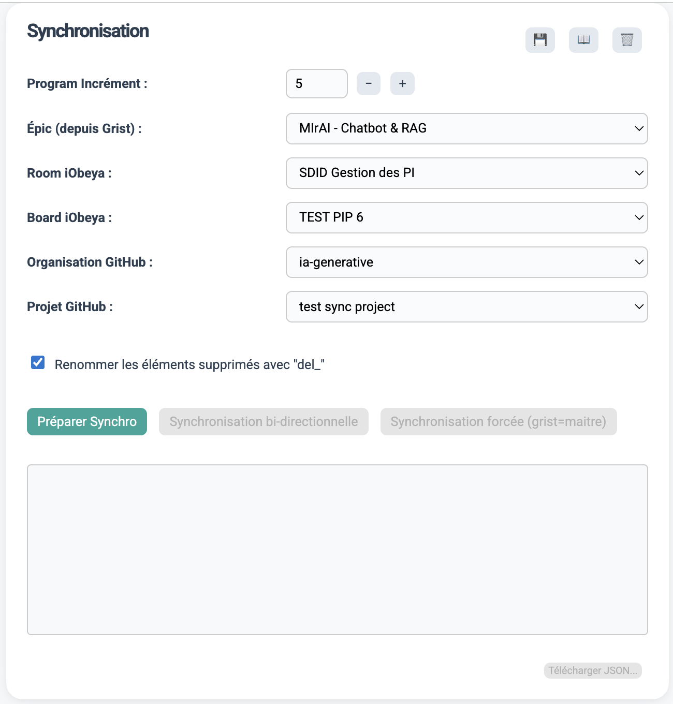
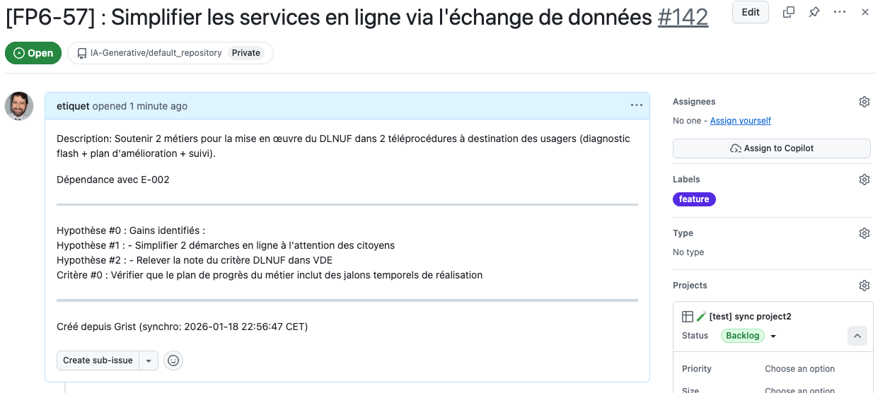
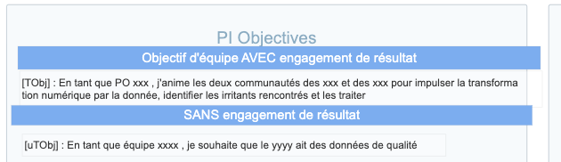
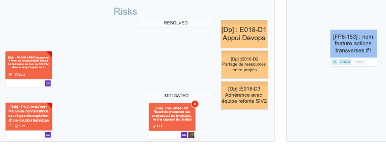
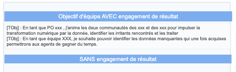
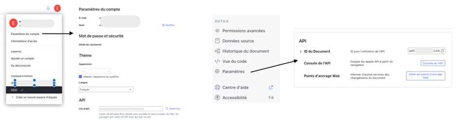
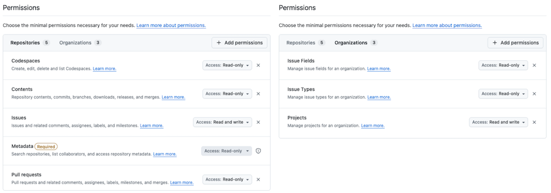
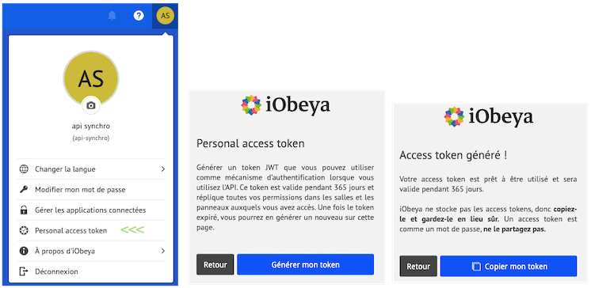

# Synchronisation Grist ↔ iObeya ↔ GitHub (Interface Web complète)

## Description
Ce projet permet de synchroniser automatiquement les **features** issues de **Grist**
vers un **panneau iObeya** et un **projet GitHub**, via une interface Web Flask.
L’interface gère désormais la **synchronisation étatful**, les **projets GitHub multi-repositories**, ainsi qu’un **contrôle fin des actions de synchronisation** (pull/push par cible).

### Fonctionnalités
- Sélection de l'épic, de la source Grist, de la room iObeya et du projet GitHub.
- Vérification des changements avant synchronisation.
- Synchronisation normale ou forcée (écrasement complet des destinations).
- Option pour renommer les éléments supprimés avec le préfixe `del_`.
- Gestion d’un cycle de synchronisation explicite : préparation obligatoire, invalidation automatique après modification des paramètres.
- Boutons d’actions indépendants (pull Grist, push iObeya, push GitHub) avec verrouillage automatique selon l’état de préparation.
- Support des projets GitHub multi-repositories (mono-repo sélectionné automatiquement si nécessaire).
- Enrichissement GitHub : récupération des identifiants REST et GraphQL des issues, mise à jour des titres et labels (ex. `Feature`).
- Gestion des labels GitHub personnalisés (création, vérification, couleur).
- Télémetrie et logs de debug privilégiés côté front (pas de pop‑up bloquant).

## Installation
```bash
pip install -r requirements.txt
```

## Lancement
En mode développeur, le lancement s'effectue depuis Vscode en mode debug ou non
Ou bien directement depuis une ligne de commande.

```bash
python -m webapp.app
```
Le lanceur vous donne les informations sur l'adresse d'écoute de l'application, ex: 
2026-01-18 22:10:08,277 [INFO] 🚀 (server) Flask sur le port 443 (HTTPS)
 * Serving Flask app 'app'
 * Debug mode: off

En mode debug le port est 8443 qui ne nécessite pas les droits root sur la machine.

Attention : 
Pour fonctionner cela nécessite des certificats + un fichier de configuration avec les paramètres positionnés vers vos environnements. 
- voir le dossier ./deploy qui contient les instructions et script nécessaires pour générer les certificats. ( explications en bas de page )
- voir également le fichier d'exemple config.example.yml. 

Note: il est recommandé de positionner les secrets dans les variables d'env > cf le code + config.example.yml pour le nom des variables. ( texte en majuscule)

Pour vos tests, pour effacer l'ensemble des Issues d'un repository.
voir le script dans le répertoire ./exemple/

Nécessite de placer l'apikey et de spécifier le repository (changer par le votre) :

```

export GITHUB_TOKEN="ghp_..."   # token avec droits suffisants sur le repo

python3 delete_issues.py --repo IA-Generative/default_repository --dry-run --repo <owner>/<repo>
python3 delete_issues.py --repo IA-Generative/default_repository --repo <owner>/<repo>
python3 delete_issues.py --repo IA-Generative/default_repository --yes
```

En développement ouvrez avec votre navigateur l'emplacement localhost
[https://localhost:8443](https://localhost:8443) si utilisation en local ou à l'emplacement hébergé sur un serveur.

## 1. Utilisation et logique de fonctionnement

Vous accédez alors à l’interface Web complète de synchronisation entre **Grist**, **iObeya** et **GitHub**.



**Logique générale d'utilisation**
---

Le projet vise à centraliser la gestion des **features** (fonctionnalités, user stories, etc.) présentes dans trois outils distincts :  
- **Grist** (base de référence)  
- **iObeya** (suivi visuel sur les panneaux)  
- **GitHub** (suivi technique dans les projets ou issues)

La synchronisation repose sur une logique de comparaison :
- Les données sont d’abord **récupérées depuis chaque source**.
- Les différences (ajouts, suppressions, modifications) sont **analysées et affichées**.
- L’utilisateur décide ensuite de **synchroniser dans un sens ou dans l’autre**, selon les besoins.

**L’interface repose sur une logique d’état :**
- la synchronisation n’est possible que si une préparation a été lancée ;
- toute modification de sélection invalide l’état courant ;
- les actions qui ne sont pas possibles sont visuellement désactivées.

**Sauvegarde des préférences**
   - Les sélections (Epic, room, projet, etc.) peuvent être enregistrées dans un **cookie** via le bouton **« Sauvegarder les préférences »**, puis restaurées avec **« Charger les préférences »** au prochain démarrage.
   - Le bouton **« Supprimer les préférences »** efface le cookie enregistré.


### Étapes d’utilisation

0. **Accéder à l'url du front**
    La page se charge et récupère via les API respectives les premières informations.
    Si vous avez enregistré précédemment les sélections dans un cookie, ces valeurs seront rechargées automatiquement. (un message s'affiche l'indiquant)

1. **Sélection des paramètres**
   - Indiquez sur quel incrément de planning (PI) la synchronisation doit s'effectuer.
   - Choisissez :
     - l’**Epic** concerné,
     - la **Room iObeya**, puis le **Board** cible. (les rooms et les boards sont chargés dynamiquement),
     - l'organisation, puis le **projet GitHub** correspondant.  (les projets sont chargés dynamiquement depuis l'organisation sélectionnée)
   Ces menus sont automatiquement alimentés via les API respectives.
   Toute modification d’un paramètre invalide automatiquement la préparation précédente et force une nouvelle phase de préparation avant synchronisation.

Positionner les menus  **Board iObeya** ou **projet GitHub** à **"Sans action"** pour ne pas prendre en compte le système dans la synchronisation.

2. **Préparation**
   - Cliquez sur le bouton **« Préparer »** pour charger et comparer les données entre les trois systèmes, sans effectuer de synchronisation.
   - Un tableau récapitulatif s’affiche, indiquant les différences détectées (ajouts, modifications, suppressions).
   - Vous pouvez ainsi visualiser les écarts avant toute action.
   - le bouton **Télécharger JSON...** permet de télécharger l'ensemble des différences pour aider à la vérification ou sauvegarde des données manipulées.
   - La préparation fige l’état des données ; toute modification ultérieure désactive les actions de synchronisation jusqu’à relance.

3. **Synchronisation**
   - Actions ciblées : synchronisation vers iObeya et/ou GitHub selon les boutons activés.
   - **« Synchronisation forcée »** : écrase totalement les données des destinations avec celles de Grist (⚠️ à utiliser avec prudence).  
   - Si la case **« Renommer les éléments supprimés »** est cochée, les éléments supprimés seront renommés avec le préfixe `del_` au lieu d’être supprimés définitivement.


### ℹ️ A savoir dans l'utilisation de Github & Iobeya pour permettre une bonne prise en compte des objects  

Le systeme génère des identifiant à chaque objet de la forme **'[(x)P(pi num)-(identifiant)]'**, ex: FP6-053 ou TObjP6-001

x : prend F comme feature, TObj/uTObj pour les objectifs, R pour risques, Issue pour bug/issue D pour dépendance.

Lorsqu'une card / issue est créé la convention suivante est mise en oeuvre cela permet d'importer automatiquement dans grist les objets. ( voir sync/sync_utils.py )
 de synchro interprête les en-tete suivant et les transforme en objet dans Grist.
 
    Rules (case-insensitive):
      - feature tag: [Feat]
      - risk tag:    [Rsk] ou [Risk]
      - dependance  tag:  [DP]
      - team objective committed tag:    [TObj] 
      - team objective uncommitted tag   [uTObj]
      - issue tag:   [Bug], [Issue] 

    Par exemple, l'en-tête suivant permet de reconnaitre un objectif d'équipe "Committed":

    [TObj] : En tant que PO xxx , j'anime les deux communautés des xxx et des xxx pour impulser la transformation numérique par la donnée, identifier les irritants rencontrés et les traiter  


**Exemple d'issue dans github :**



**Exemple d'objectif dans iObeya :**
Utilisez l'outil "texte libre"



**Exemple de risk & dépendance dans iObeya :**
Utilisez les outils "Notes" ou "Card" ou "Feature Card"



## A prendre en compte lors de la création des objets dans Iobeya et Github

  **Dans iobeya**, utilisez les objets de nature : **Freetext, NoteCard, Cards et Feature cards**. (cf. exemples ci-dessus )

  Dans **Github** seuls les **objets** issues sont gérés (PR ignoré).

  Lors d'un import vers **Grist** les éléments sont renommés avec un num d'objet automatiquement et l'élément original est mis à jour. Sur Github le tag **Feature** est ajouté au repository et à l'issue.

  En écriture depuis **Grist** vers **iObeya** & **Github** seules les **"Features"** sont poussées.

⚠️ IMPORTANT : ne mettre qu'un seul sujet par objet, dans l'exemple ci-dessous, seule la première ligne sera prise en compte.




### 4. Génération des tokens 


Dans **Grist**
---

Créez un profil dédié à l'API et générez un token, puis récupérer le l'identifiant du document dans paramètre.




Dans **Github**
---

Dans github, les accès API respectent un principe de moindre privilège (tokens Git


Dans **iObeya**
---

Créez un utilisateur dédié à la synchro avec les droits juste nécessaire.




## Exécution en HTTPS

Le projet peut être exécuté en HTTPS sur le port 443 pour un usage sécurisé.

### Certificats

Deux modes sont possibles pour générer les certificats TLS dans le dossier `certs/` :
- **Développement local (macOS)** : via [`mkcert`](https://github.com/FiloSottile/mkcert) ou, à défaut, **OpenSSL** (auto-signé).
- **Production (VM Linux)** : via **Let's Encrypt** et `certbot`.

### Script d’automatisation

Un script `deploy/generate-certs.sh` est fourni pour automatiser la génération :
```bash
# Pour un environnement local
./deploy/generate-certs.sh localhost local

# Pour un serveur de production
sudo ./deploy/generate-certs.sh mon-domaine.fr prod
```

Les certificats `fullchain.pem` et `privkey.pem` seront créés dans le dossier `certs/` et automatiquement utilisés par Docker Compose pour le lancement HTTPS.

---

### Notes sur le script de génération de certificats

Le script `deploy/generate-certs.sh` vérifie automatiquement si le répertoire `certs/` existe.  
S'il n'est pas trouvé, il est créé avant la génération des certificats.  

> ℹ️ **Bonnes pratiques Git** : pensez à ajouter le dossier `certs/` dans votre fichier `.gitignore` pour éviter de versionner les fichiers de clés ou de certificats sensibles :
> ```bash
> certs/
> ```

---

## 🔧 Dépendances et installation

### Environnement local

Le projet utilise un environnement Python virtuel (`.venv`) pour isoler les dépendances.  
Avant de démarrer, assurez-vous d’installer toutes les bibliothèques requises :

```bash
source .venv/bin/activate
pip install -r requirements.txt
```

### Fichier `requirements.txt`

Ce fichier contient l’ensemble des dépendances nécessaires, notamment :

```
flask
pyyaml
requests
watchdog
```

Le module **`watchdog`** est indispensable au rechargement automatique du serveur Flask lors des modifications de fichiers (`.py`, `.yaml`, `.html`).  

Si ce module n’est pas installé, vous verrez une erreur de type :
```
ModuleNotFoundError: No module named 'watchdog'
```
Dans ce cas, exécutez simplement :
```bash
pip install watchdog
```

### Docker et build d’image

Pour garantir que les dépendances soient bien installées dans le conteneur Docker,  
vérifiez que votre fichier `deploy/Dockerfile` contient les lignes suivantes :

```dockerfile
COPY . .
RUN pip install --no-cache-dir -r requirements.txt
```

Ainsi, `watchdog` (et toutes les autres dépendances) seront installés automatiquement lors du `docker compose build`.

---

💡 **Astuce :**  
Si vous développez sur macOS, il peut arriver que `watchdog` ne s’installe pas par défaut.  
Dans ce cas :

```bash
echo "watchdog" >> requirements.txt
pip install -r requirements.txt
```

Ensuite relancez le serveur avec :
```bash
python -m webapp.app
```

---

## ⚙️ Lancement rapide

### Démarrage en local
```bash
source .venv/bin/activate
python -m webapp.app
```

### Démarrage via Docker Compose
Depuis le dossier `deploy/` :
```bash
docker compose up --build
```

L’application sera alors disponible en :
- HTTPS : https://localhost  
- ou HTTP fallback (port 28080)

---

## 🧰 Dépannage (FAQ)

### ❓ *Erreur :* `No module named app`
**Cause :** Flask essaie de relancer le serveur avec `python -m app`, mais le module réel est `webapp.app`.  
**Solution :**
- Lancez toujours votre application via :
  ```bash
  python -m webapp.app
  ```
- Ou utilisez VSCode avec le `launch.json` suivant :
  ```json
  {
      "type": "python",
      "request": "launch",
      "module": "webapp.app",
      "console": "integratedTerminal"
  }
  ```

---

### ❓ Les boutons sont désactivés après un changement de menu
**Cause :** la préparation précédente a été invalidée.
**Solution :** relancez simplement l’étape « Préparer » avant toute synchronisation.

### ❓ *Erreur :* `KeyError: 'WERKZEUG_SERVER_FD'`
**Cause :** conflit entre le reloader interne de Flask et HTTPS.  
**Solution :**
- Cette erreur est corrigée dans la version actuelle grâce à **Watchdog**, qui remplace le reloader Flask.
- Si elle réapparaît, assurez-vous que `use_reloader=False` n’est pas activé **en même temps** que `run_with_reloader()`.

---

### ❓ *Avertissement :* `NotOpenSSLWarning` ou problème avec LibreSSL
**Cause :** macOS utilise la version de Python livrée avec Xcode (compilée avec LibreSSL).  
**Solution :**
- Installez Python via Homebrew pour bénéficier d’OpenSSL complet :
  ```bash
  brew install python@3.11
  ```
- Puis recréez votre environnement virtuel :
  ```bash
  python3.11 -m venv .venv
  source .venv/bin/activate
  pip install -r requirements.txt
  ```

---

### ❓ *Erreur :* `ModuleNotFoundError: No module named 'sync'`
**Cause :** le module `sync/` est placé à la racine et non dans `webapp/`.  
**Solution :**
Ajoutez cette ligne en haut du fichier `webapp/app.py` :
```python
import os, sys
sys.path.append(os.path.abspath(os.path.join(os.path.dirname(__file__), "..")))
```

---

### ❓ *Problèmes de certificat HTTPS (fichiers manquants)*
**Cause :** les certificats `fullchain.pem` et `privkey.pem` ne sont pas trouvés.  
**Solution :**
- Générez des certificats locaux :
  ```bash
  cd deploy
  ./generate-certs.sh
  ```
- Les fichiers seront créés dans `certs/`. Le serveur redémarrera automatiquement en HTTPS.
